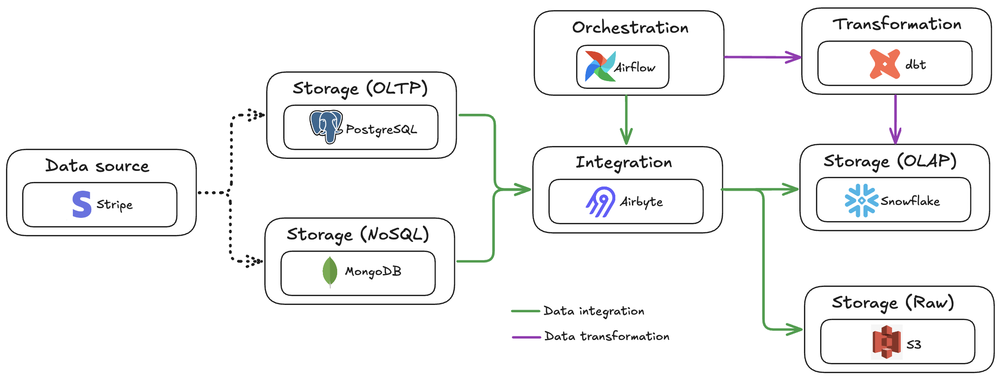

# Dossier d'architecture

[Cas d'étude](business_case.pdf)

## Contexte
Stripe, leader des technologies financières, veut bâtir une infrastructure de données unifiée et évolutive pour gérer la croissance de ses volumes. L’objectif est d’intégrer ses systèmes transactionnels (OLTP), analytiques (OLAP) et NoSQL afin de traiter d’importantes données, permettre des analyses complexes et exploiter des données non structurées pour la détection de fraude, l’analyse comportementale et les recommandations en temps réel.

## Architecture globale


## Conception du modèle de données

### OLTP


#### Principales caractéristiques
<details open>
<summary>Propriétés ACID</summary>

```sql
BEGIN;

-- Step 1 : Update the status of a transaction
UPDATE Transaction 
SET TransactionStatusID = 2, UpdatedAt = CURRENT_TIMESTAMP  
WHERE ID = 012345;

-- Step 2 : Insert the status update in the audit log table
INSERT INTO TransactionStateChanges (TransactionID, FromStatusID, ToStatusID, Reason, UpdatedBy, UpdatedAt)
VALUES (012345, 1, 2, "Exceptional refund", "Customer service", CURRENT_TIMESTAMP)

-- Commit the transaction if both steps succeed
COMMIT;

-- Rollback the transaction if an error occurs
ROLLBACK;
```
</details>

<details open>
<summary>Partitionnement</summary>

```sql
CREATE TABLE Transaction (
  ID INT GENERATED BY DEFAULT AS IDENTITY PRIMARY KEY,
  TransactionStatusID int,
  MerchantID int,
  Amount float,
  CurrencyID int,
  PaymentMethodID int,
  DeviceID int,
  CustomerID int,
  BillingAddressID int,
  TransactionLocationID int,
  DateTime timestamp,
  CreatedAt TIMESTAMP DEFAULT CURRENT_TIMESTAMP,
  UpdatedAt TIMESTAMP DEFAULT CURRENT_TIMESTAMP
) PARTITION BY RANGE (DateTime); -- Partioning for queries performance
```
</details>

<details open>
<summary>Cryptage</summary>

```sql
-- Using pgcrypto, insert the crypted password and Fullname with different method
INSERT INTO Customer (UserName, Password, Email, FullName)
VALUES ("John42", crypt("password_john", gen_salt("bf")), "john.doe@stripe.com", pgp_sym_encrypt("John Doe", "secret_key")); 

SELECT (Password = crypt("password_john", Password)) AS IsGoodPassword
FROM Customer ; -- Return true if password match
```
</details>

<details open>
<summary>RBAC (Role-Based Access Control)</summary>

```sql
CREATE ROLE Admin;
CREATE ROLE Developer;
CREATE ROLE ReadOnlyUser;

GRANT ALL PRIVILEGES ON DATABASE mydb TO Admin;
GRANT SELECT, INSERT, UPDATE, DELETE ON ALL TABLES IN SCHEMA public TO Developer;
GRANT SELECT ON ALL TABLES IN SCHEMA public TO ReadOnlyUser;
```
</details>

<details open>
<summary>Technical audit logging</summary>

```sql
ALTER SYSTEM SET log_connections = 'on';
ALTER SYSTEM SET log_disconnections = 'on';
ALTER SYSTEM SET log_statement = 'all';
```
</details>

<br>

Script SQL complet : [Ici](src/oltp.sql)

### OLAP


#### Principales caractéristiques
<details open>
<summary>Pré-aggrégation</summary>

```sql
CREATE TABLE FACT_CustomerSegmentation (
    ID INT GENERATED BY DEFAULT AS IDENTITY PRIMARY KEY,
    DateKey int,
    CustomerKey int,
    LocationKey int,
    TransactionCount int, -- Pre-aggregated field 
    TotalSpent float -- Pre-aggregated field
);
```
</details>

<details open>
<summary>Analyse chronologique</summary>

```sql
-- Date dimension is used by every fact tables
CREATE TABLE DIM_Date (
    DateKey INT GENERATED BY DEFAULT AS IDENTITY PRIMARY KEY,
    FullDate date,
    Day varchar,
    Month varchar,
    Quarter int,  
    Year int,
    isHoliday bool,
    isWeekend bool
);
```
</details>

<details open>
<summary>Jointures à grande échelle</summary>

```sql
CREATE TABLE FACT_FraudAnalysis (
    ID  INT GENERATED BY DEFAULT AS IDENTITY PRIMARY KEY,
    DateKey int,
    CustomerKey int,
    MerchantKey int,
    LocationKey int,
    PaymentMethodKey int,
    FraudCount int
);

-- Multiple foreign keys
ALTER TABLE FACT_FraudAnalysis ADD FOREIGN KEY (DateKey) REFERENCES DIM_Date (DateKey);
ALTER TABLE FACT_FraudAnalysis ADD FOREIGN KEY (CustomerKey) REFERENCES DIM_Customer (CustomerKey);
ALTER TABLE FACT_FraudAnalysis ADD FOREIGN KEY (MerchantKey) REFERENCES DIM_Merchant (MerchantKey);
ALTER TABLE FACT_FraudAnalysis ADD FOREIGN KEY (LocationKey) REFERENCES DIM_Location (LocationKey);
ALTER TABLE FACT_FraudAnalysis ADD FOREIGN KEY (PaymentMethodKey) REFERENCES DIM_PaymentMethod (PaymentMethodKey);
```
</details>

### NoSQL


#### Principales caractéristiques
<details open>
<summary>Intégration</summary>

```json
// Log collection
{
    "_id": ObjectId("23"),
    ...
    "lines": [ // Logs for one specific query are directly stored on the related document
      {
        "timestamp": { "$date": "2025-09-08T22:49:21.808Z" },
        "error_severity": "LOG",
        "message": "statement: SELECT * FROM CustomerInteractions;"
      },
      {
        "timestamp": { "$date": "2025-09-08T22:49:21.808Z" },
        "error_severity": "ERROR",
        "state_code": "42P01",
        "message": "Table `CustomerInteractions` does not exist",
        "statement": "SELECT * FROM CustomerInteractions;"
      }
    ]
}
```
</details>

<details open>
<summary>Référencement</summary>

```json
// CustomerReview collection
{
    "_id": ObjectId("0"),
    "transaction_id": 012345,
    "customer_id" : ObjectId("12"), // Referencing one specific Customer document
    "merchant_id" : ObjectId("64"), // Referencing one specific Merchant document
    "rating": 4,
    "message": "The product was not what I wanted, but customer service refunded me quickly.",
    "timestamp": { "$date": "2025-09-09T14:49:21.808Z" }
}
```
</details>

<details open>
<summary>Indexation</summary>

```javascript
// Compound index for faster research
db.Customer.createIndex( { "preferences.device": 1,
                           "preferences.paymentMethod": 1,
                           "preferences.currency": 1 } )
```
</details>

## Pipeline de données



### Outils et technologies

| **Nom** | **Description** | **Utilité** |
|:-|:-|:-|
| **Airbyte** | Outil d'intégration de données (ELT) | Ingestion et chargement des données PostgreSQL/MongoDB vers Snowflake/Amazon S3 |
| **Airflow** | Outil d'orchestration de workflows | Planification et execution des tâches d'ingestion, de chargement (Airbyte) et de transformation (dbt) |
| **dbt** | Outil de transformation de données | Transformation des données transactionnelles (OLTP), non structurées et semi-structurées (NoSQL) en données analytiques (OLAP) |
| **MongoDB** | Base de données non structurées et semi-structurées (NoSQL) | Stockage des données à des fins d'utilisation dans des modèles de machine learning |
| **PostgreSQL** | Base de données relationnelle (OLTP) | Stockage des données transactionnelles |
| **Amazon S3** | Lac de données | Stockage de données brut |
| **Snowflake** | Base de données relationnelle (OLAP) | Stockage des données analytiques |

### Traitements

| **Type** | **Description** | **Cible** |
|:-|:-|:-|
| **Batch** | Ingestion, chargement et transformation des données pour de l'analytique (revenue, performance des produits, etc.) | Snowflake |
| **Batch** | Ingestion, chargement et transformation des données pour de l'exploration/expérimentation | Amazon S3 |
| **Stream** | Ingestion, chargement et transformation des données en temps-réels (module Change Data Capture) pour de l'analytique (fraudes) | Snowflake |

## Cadre de sécurité et de conformité

### Chiffrement des données

**Données au repos**
- Le chiffrement AES-256 est utilisé pour toutes les données des systèmes OLTP, OLAP et NoSQL.
- Etablissement de clés de chiffrement par base et par table, avec rotation régulière.
- Cryptage des données sensibles (informations personnelles identifiables, données de paiement, mots de passe).

**Données en transit**
- L'utilisation du TLS est obligatoire pour toutes les communications, tant internes qu'externes.

**Gestion des clés**
- Centralisation, gestion et rotation des clés via un KMS (Key Management System).
- Application d'un contrôle d’accès strict aux clés, distinct des autorisations d’accès aux données.

### Contrôle d’accès

**RBAC (Role-Based Access Control)**
- Définition de rôles précis pour tous les intervenants (Administrateur, Développeur, Utilisateur en lecture).
- Application du principe du moindre privilège afin de restreindre l'accès à ce qui est strictement nécessaire.
- Mise en place de droits d'accès temporaires pour les prestataires ou projets à dates finies.

**Authentification et Autorisation**
- Utilisation de l'authentification multifacteur (MFA) pour accèder aux données sensibles.
- Intégration d'un fournisseur d'identité (IdP) pour SSO via SAML.
- Centralisation des logs d'accès et audit sur ces derniers.

### Logs et surveillance

**Exigences de logs d'audit**
- Toutes les actions sur les base de données sont consignées (accès aux données, changements de système, requêtes, etc.).
- Chaque log possède des métadonnées (horodatage, nom utilisateur, adresse IP, etc.).
- Les enregistrements sont immuables avec des périodes de rétention dédiées (ex. : 1 an pour PCI-DSS).

**Surveillance et alertes**
- Mise en place en place d'une surveillance pour détecter les accès ou exportations anormaux (sur la base des logs générés)
- Configuration d'alertes automatiques en cas d’incident de sécurité ou de non-conformité.

### Stratégies de conformité réglementaire

**RGPD**
- Mise en place de processus garantissant aux utilisateurs l’accès, la modification ou la suppression de leurs données.
- Consentement explicite collecté préalablement à tout traitement de données personnelles.
- En cas de violation, notification des autorités dans un délai de 72 heures conformément au RGPD.

**CCPA**
- Mise en place de mécanismes clairs pour un client de refuser la vente de leurs données personnelles.
- Mise en place de processus garantissant aux utilisateurs l’accès ou la suppression de leurs données.
- Aucune discrimination d'un utilisateur dans l’exercice de ses droits sous CCPA.

**PCI-DSS**
- Mise en place d'infrastructure avec pare-feu et politiques de sécurité pour protéger les données de paiement.
- Aurotisations restreintes pour accès aux informations sensibles.
- Mise en place de surveillance et audit permanents pour prévenir les vulnérabilités.

### Reporting et suivi automatisés

**Plateforme de gouvernance des données**
- Mise en place d'outil pour la documentation et classification des données (PII, non PII, PCI-DSS, etc.).
- Surveillance des accès et des viloations de politiques.

**Suivi de conformité**
- Mise en place d'un tableau de bord de conformité.
- Suivi d'indicateurs de couverture de chiffrement, respect des politiques d'accès, conformité de la rétention et d'incidents de sécurité.
- Détection automatique des droits d'accès expirés et transfert non autorisés

**Intégration IA**
- Utilisation de modèle de détection d'anomalies dans les logs et transactions.

## Architecture machine learning


### Outils et technologies

| **Nom** | **Description** | **Utilité** |
|:-|:-|:-|
| **Airflow** | Outil d'orchestration de workflows | Planification et execution des tâches de détection des drifts, d'entrainement du modêle et de prédiction |
| **Amazon EC2** | Outil de création de machines virtuelles | Entrainement du modèle de machine learning |
| **Amazon EKS** | Outil d'orchestration de container Kubernetes | Déploie des instances EC2 en fonction de la puissance de calcul nécessaire pour l'entrainement |
| **Evidently** | Outil de tests et d'observabilité de l'IA | Génère des rapports de qualité sur le jeu de données |
| **FastAPI** | Framework de construction d'API | Récupère le modèle de machine learning sur MLFlow et effectue les prédictions |
| **Github** | Outil de versionning de code | Stocke le code d'entrainement du modèle de machine learning |
| **Jenkins** | Outil de d'intégration et déploiement | Valide et test les développements effectués sur le code du modèle de machine learning |
| **MLFlow** | Outil de versionning, monitoring, packaging et déploiement pour des modèles de machine learning | Stockage du modèle du modèle après entrainement |
| **MongoDB** | Base de données non structurées et semi-structurées (NoSQL) | Stockage des données à des fins d'utilisation dans des modèles de machine learning |
| **PostgreSQL** | Base de données relationnelle (OLTP) | Stockage des données transactionnelles |

### Traitements

| **Type** | **Description** |
|:-|:-|
| **Prédiction** | Détection de fraudes sur les transactions |
| **Prédiction** | Détection d'anomalie de sécurité et de conformité sur les logs |
| **Qualité** | Détection de drift dans le jeu de donneés |
| **Qualité** | Validation et test unitaires du code |

## Exemples de requêtes SQL et NoSQL

### OLAP (Snowflake)
<details open>
<summary>Montant mensuel des taxes pour le secteur du commerce de détail en France</summary>

```sql
SELECT d.Year, d.Month, SUM(r.TaxAmount) AS MonthlyTaxAmount
FROM FACT_Revenue AS r
JOIN DIM_Date AS d ON r.DateKey = d.DateKey
JOIN DIM_Merchant AS m ON r.MerchantKey = m.MerchantKey
JOIN DIM_Location AS l ON r.LocationKey = l.LocationKey
WHERE m.Industry = "Retail" AND l.Country = "France"
GROUP BY d.Year, d.Month
ORDER BY d.Year, d.Month;
```
</details>

<details open>
<summary>Nombre quotidien de fraudes liées aux paiements par carte de crédit chez les petits commerçants</summary>

```sql
SELECT d.FullDate, SUM(f.FraudCount) AS DailyFraudCount
FROM FACT_FraudAnalysis AS f
JOIN DIM_Date AS d ON f.DateKey = d.DateKey
JOIN DIM_PaymentMethod AS p ON f.PaymentMethodKey = p.PaymentMethodKey
JOIN DIM_Merchant AS m ON f.MerchantKey = m.MerchantKey
WHERE p.Name = "Credit Card" AND m.Size = "Small"
GROUP BY d.FullDate
ORDER BY d.FullDate;
```
</details>

<details open>
<summary>Montant annuel total dépensé par un client premium en France</summary>

```sql
SELECT d.Year, SUM(cs.TotalSpent) AS YearlyTotalSpent
FROM FACT_CustomerSegmentation AS cs
JOIN DIM_Date AS d ON cs.DateKey = d.DateKey
JOIN DIM_Customer AS c ON cs.CustomerKey = c.CustomerKey
JOIN DIM_Location AS l ON cs.LocationKey = l.LocationKey
WHERE c.CustomerSegment = "Premium" AND l.Country = "France"
GROUP BY d.Year
ORDER BY d.Year;
```
</details>

### NoSQL (MongoDB)
<details open>
<summary>Rechercher tous les journaux d'erreurs créés par un utilisateur administrateur dans la base de données Stripe</summary>

```javascript
db.Log.find({
  dbname: "stripe",
  user: "admin",
  lines: { $elemMatch: { error_severity: "ERROR" } }
})
```
</details>

<details open>
<summary>Les cinq systèmes d'exploitation les plus utilisés</summary>

```javascript
db.UserInteractionData.aggregate([
  {
    $group: {
      _id: "$device.os",
      count: { $sum: 1 }
    }
  },
  { $sort: { count: -1 } },
  { $limit: 5 }
])
```
</details>

<details open>
<summary>Récupérer tous les avis concernant un commerçant spécifique pour un client spécifique</summary>

```javascript
db.CustomerReview.find({
  customer_id: ObjectId("12"),
  merchant_id: ObjectId("64")
})
```
</details>