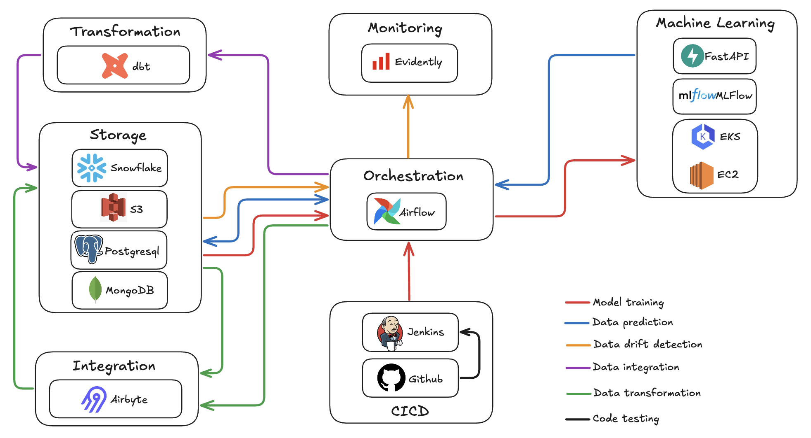
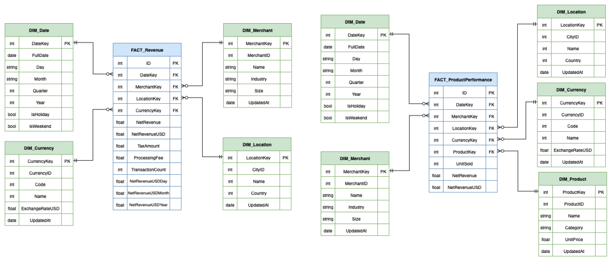
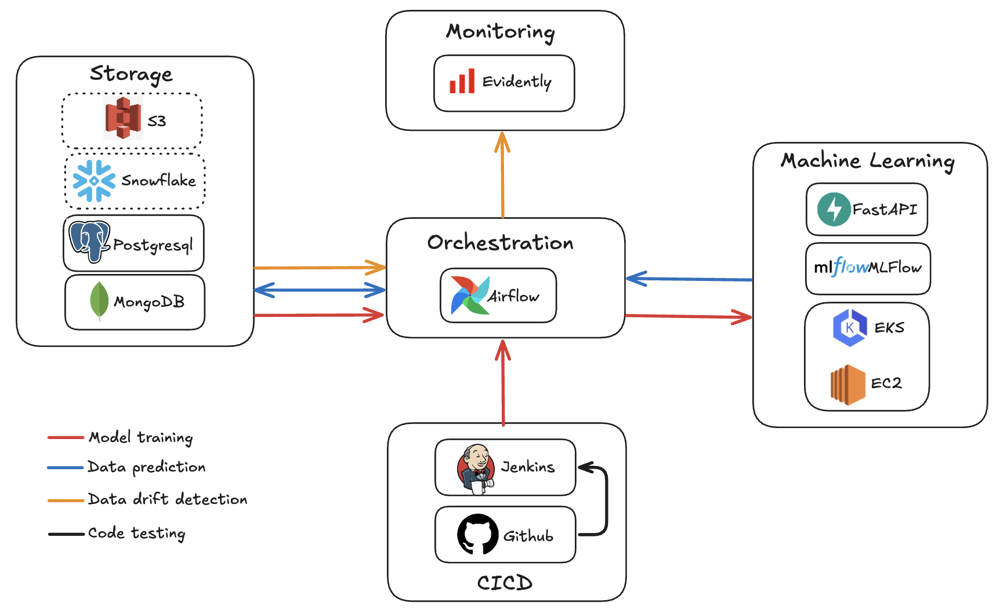

# Architecture File

## Context
Stripe, a leader in financial technologies, aims to build a unified and scalable data infrastructure to manage its growing data volumes. The goal is to integrate its transactional (OLTP), analytical (OLAP), and NoSQL systems in order to process large datasets, enable complex analytics, and leverage unstructured data for fraud detection, behavioral analysis, and real-time recommendations.

## Global Architecture


## Data Model Design

### OLTP


#### Main Features
<details open>
<summary>ACID Properties</summary>

```sql
BEGIN;

-- Step 1: Update the status of a transaction
UPDATE Transaction 
SET TransactionStatusID = 2, UpdatedAt = CURRENT_TIMESTAMP  
WHERE ID = 012345;

-- Step 2: Insert the status update into the audit log table
INSERT INTO TransactionStateChanges (TransactionID, FromStatusID, ToStatusID, Reason, UpdatedBy, UpdatedAt)
VALUES (012345, 1, 2, "Exceptional refund", "Customer service", CURRENT_TIMESTAMP)

-- Commit the transaction if both steps succeed
COMMIT;

-- Rollback the transaction if an error occurs
ROLLBACK;
```
</details>

<details open>
<summary>Partitioning</summary>

```sql
CREATE TABLE Transaction (
  ID INT GENERATED BY DEFAULT AS IDENTITY PRIMARY KEY,
  TransactionStatusID int,
  MerchantID int,
  Amount float,
  CurrencyID int,
  PaymentMethodID int,
  DeviceID int,
  CustomerID int,
  BillingAddressID int,
  TransactionLocationID int,
  DateTime timestamp,
  CreatedAt TIMESTAMP DEFAULT CURRENT_TIMESTAMP,
  UpdatedAt TIMESTAMP DEFAULT CURRENT_TIMESTAMP
) PARTITION BY RANGE (DateTime); -- Partitioning for query performance
```
</details>

<details open>
<summary>Encryption</summary>

```sql
-- Using pgcrypto, insert the encrypted password and Fullname with different methods
INSERT INTO Customer (UserName, Password, Email, FullName)
VALUES ("John42", crypt("password_john", gen_salt("bf")), "john.doe@stripe.com", pgp_sym_encrypt("John Doe", "secret_key")); 

SELECT (Password = crypt("password_john", Password)) AS IsGoodPassword
FROM Customer; -- Returns true if password matches
```
</details>

<details open>
<summary>RBAC (Role-Based Access Control)</summary>

```sql
CREATE ROLE Admin;
CREATE ROLE Developer;
CREATE ROLE ReadOnlyUser;

GRANT ALL PRIVILEGES ON DATABASE mydb TO Admin;
GRANT SELECT, INSERT, UPDATE, DELETE ON ALL TABLES IN SCHEMA public TO Developer;
GRANT SELECT ON ALL TABLES IN SCHEMA public TO ReadOnlyUser;
```
</details>

<details open>
<summary>Technical Audit Logging</summary>

```sql
ALTER SYSTEM SET log_connections = 'on';
ALTER SYSTEM SET log_disconnections = 'on';
ALTER SYSTEM SET log_statement = 'all';
```
</details>

<br>

Full SQL Script: [Here](src/oltp.sql)

### OLAP



#### Main Features
<details open>
<summary>Pre-aggregation</summary>

```sql
CREATE TABLE FACT_CustomerSegmentation (
    ID INT GENERATED BY DEFAULT AS IDENTITY PRIMARY KEY,
    DateKey int,
    CustomerKey int,
    LocationKey int,
    TransactionCount int, -- Pre-aggregated field 
    TotalSpent float -- Pre-aggregated field
);
```
</details>

<details open>
<summary>Time Series Analysis</summary>

```sql
-- The Date dimension is used by every fact table
CREATE TABLE DIM_Date (
    DateKey INT GENERATED BY DEFAULT AS IDENTITY PRIMARY KEY,
    FullDate date,
    Day varchar,
    Month varchar,
    Quarter int,  
    Year int,
    isHoliday bool,
    isWeekend bool
);
```
</details>

<details open>
<summary>Large-Scale Joins</summary>

```sql
CREATE TABLE FACT_FraudAnalysis (
    ID  INT GENERATED BY DEFAULT AS IDENTITY PRIMARY KEY,
    DateKey int,
    CustomerKey int,
    MerchantKey int,
    LocationKey int,
    PaymentMethodKey int,
    FraudCount int
);

-- Multiple foreign keys
ALTER TABLE FACT_FraudAnalysis ADD FOREIGN KEY (DateKey) REFERENCES DIM_Date (DateKey);
ALTER TABLE FACT_FraudAnalysis ADD FOREIGN KEY (CustomerKey) REFERENCES DIM_Customer (CustomerKey);
ALTER TABLE FACT_FraudAnalysis ADD FOREIGN KEY (MerchantKey) REFERENCES DIM_Merchant (MerchantKey);
ALTER TABLE FACT_FraudAnalysis ADD FOREIGN KEY (LocationKey) REFERENCES DIM_Location (LocationKey);
ALTER TABLE FACT_FraudAnalysis ADD FOREIGN KEY (PaymentMethodKey) REFERENCES DIM_PaymentMethod (PaymentMethodKey);
```
</details>

### NoSQL


#### Main Features
<details open>
<summary>Integration</summary>

```json
// Log collection
{
    "_id": ObjectId("23"),
    ...
    "lines": [ // Logs for a specific query are directly stored within the related document
      {
        "timestamp": { "$date": "2025-09-08T22:49:21.808Z" },
        "error_severity": "LOG",
        "message": "statement: SELECT * FROM CustomerInteractions;"
      },
      {
        "timestamp": { "$date": "2025-09-08T22:49:21.808Z" },
        "error_severity": "ERROR",
        "state_code": "42P01",
        "message": "Table `CustomerInteractions` does not exist",
        "statement": "SELECT * FROM CustomerInteractions;"
      }
    ]
}
```
</details>

<details open>
<summary>Referencing</summary>

```json
// CustomerReview collection
{
    "_id": ObjectId("0"),
    "transaction_id": 012345,
    "customer_id" : ObjectId("12"), // References a specific Customer document
    "merchant_id" : ObjectId("64"), // References a specific Merchant document
    "rating": 4,
    "message": "The product was not what I wanted, but customer service refunded me quickly.",
    "timestamp": { "$date": "2025-09-09T14:49:21.808Z" }
}
```
</details>

<details open>
<summary>Indexing</summary>

```javascript
// Compound index for faster queries
db.Customer.createIndex({ "preferences.device": 1,
                          "preferences.paymentMethod": 1,
                          "preferences.currency": 1 })
```
</details>

## Data Pipeline


### Tools and Technologies

| **Name** | **Description** | **Purpose** |
|:-|:-|:-|
| **Airbyte** | Data integration tool (ELT) | Ingestion and loading of PostgreSQL/MongoDB data into Snowflake/Amazon S3 |
| **Airflow** | Workflow orchestration tool | Scheduling and execution of ingestion (Airbyte), loading, and transformation (dbt) tasks |
| **dbt** | Data transformation tool | Transformation of transactional (OLTP), unstructured, and semi-structured (NoSQL) data into analytical (OLAP) data |
| **MongoDB** | Unstructured and semi-structured (NoSQL) database | Storage for machine learning model usage |
| **PostgreSQL** | Relational database (OLTP) | Storage of transactional data |
| **Amazon S3** | Data lake | Raw data storage |
| **Snowflake** | Relational database (OLAP) | Analytical data storage |

### Processing

| **Type** | **Description** | **Target** |
|:-|:-|:-|
| **Batch** | Ingestion, loading, and transformation of data for analytics (revenue, product performance, etc.) | Snowflake |
| **Batch** | Ingestion, loading, and transformation of data for exploration/experimentation | Amazon S3 |
| **Stream** | Real-time ingestion, loading, and transformation (Change Data Capture module) for fraud analytics | Snowflake |

## Security and Compliance Framework

### Data Encryption

**Data at Rest**
- AES-256 encryption is used for all OLTP, OLAP, and NoSQL systems.
- Key establishment per database and per table, with regular rotation.
- Encryption of sensitive data (PII, payment information, passwords).

**Data in Transit**
- TLS is mandatory for all internal and external communications.

**Key Management**
- Centralized key management and rotation via KMS (Key Management System).
- Strict access control for keys, separated from data access permissions.

### Access Control

**RBAC (Role-Based Access Control)**
- Precise role definitions for all stakeholders (Administrator, Developer, Read-only User).
- Principle of least privilege applied to limit access strictly to what is necessary.
- Temporary access rights for contractors or time-limited projects.

**Authentication and Authorization**
- Use of multi-factor authentication (MFA) for sensitive data access.
- Integration of an Identity Provider (IdP) for SSO via SAML.
- Centralized access and audit logs.

### Logging and Monitoring

**Audit Log Requirements**
- All database actions are logged (data access, system changes, queries, etc.).
- Each log includes metadata (timestamp, username, IP address, etc.).
- Logs are immutable, with defined retention periods (e.g., 1 year for PCI-DSS).

**Monitoring and Alerts**
- Continuous monitoring to detect abnormal access or exports (based on generated logs).
- Automatic alerts in case of security incidents or compliance violations.

### Regulatory Compliance Strategies

**GDPR**
- Processes ensure users can access, modify, or delete their data.
- Explicit consent collected before processing personal data.
- In case of a breach, authorities are notified within 72 hours as required by GDPR.

**CCPA**
- Mechanisms allow customers to refuse the sale of personal data.
- Processes ensure users can access or delete their data.
- No discrimination against users exercising their CCPA rights.

**PCI-DSS**
- Firewalls and security policies implemented to protect payment data.
- Restricted authorizations for access to sensitive information.
- Continuous monitoring and auditing to prevent vulnerabilities.

### Automated Reporting and Tracking

**Data Governance Platform**
- Tools for documentation and classification of data (PII, non-PII, PCI-DSS, etc.).
- Monitoring of access and policy violations.

**Compliance Tracking**
- Compliance dashboard for encryption coverage, access policy adherence, retention compliance, and incident tracking.
- Automatic detection of expired access rights and unauthorized transfers.

**AI Integration**
- Use of anomaly detection models on logs and transactions.

## Machine Learning Architecture



### Tools and Technologies

| **Name** | **Description** | **Purpose** |
|:-|:-|:-|
| **Airflow** | Workflow orchestration tool | Scheduling and execution of drift detection, model training, and prediction tasks |
| **Amazon EC2** | Virtual machine creation tool | Machine learning model training |
| **Amazon EKS** | Kubernetes container orchestration tool | Deploys EC2 instances according to compute needs for training |
| **Evidently** | AI testing and observability tool | Generates quality reports on datasets |
| **FastAPI** | API framework | Fetches the trained ML model from MLFlow and performs predictions |
| **Github** | Code version control tool | Stores machine learning model training code |
| **Jenkins** | CI/CD tool | Validates and tests ML code developments |
| **MLFlow** | ML model versioning, monitoring, packaging, and deployment tool | Stores the trained model |
| **MongoDB** | Unstructured and semi-structured (NoSQL) database | Storage for machine learning data |
| **PostgreSQL** | Relational database (OLTP) | Transactional data storage |

### Processing

| **Type** | **Description** |
|:-|:-|
| **Prediction** | Fraud detection on transactions |
| **Prediction** | Detection of security and compliance anomalies in logs |
| **Quality** | Drift detection in datasets |
| **Quality** | Validation and unit testing of code |

## SQL and NoSQL Query Examples

### OLAP (Snowflake)
<details open>
<summary>Monthly tax amount for the retail sector in France</summary>

```sql
SELECT d.Year, d.Month, SUM(r.TaxAmount) AS MonthlyTaxAmount
FROM FACT_Revenue AS r
JOIN DIM_Date AS d ON r.DateKey = d.DateKey
JOIN DIM_Merchant AS m ON r.MerchantKey = m.MerchantKey
JOIN DIM_Location AS l ON r.LocationKey = l.LocationKey
WHERE m.Industry = "Retail" AND l.Country = "France"
GROUP BY d.Year, d.Month
ORDER BY d.Year, d.Month;
```
</details>

<details open>
<summary>Daily number of credit card payment frauds among small merchants</summary>

```sql
SELECT d.FullDate, SUM(f.FraudCount) AS DailyFraudCount
FROM FACT_FraudAnalysis AS f
JOIN DIM_Date AS d ON f.DateKey = d.DateKey
JOIN DIM_PaymentMethod AS p ON f.PaymentMethodKey = p.PaymentMethodKey
JOIN DIM_Merchant AS m ON f.MerchantKey = m.MerchantKey
WHERE p.Name = "Credit Card" AND m.Size = "Small"
GROUP BY d.FullDate
ORDER BY d.FullDate;
```
</details>

<details open>
<summary>Total annual spending by premium customers in France</summary>

```sql
SELECT d.Year, SUM(cs.TotalSpent) AS YearlyTotalSpent
FROM FACT_CustomerSegmentation AS cs
JOIN DIM_Date AS d ON cs.DateKey = d.DateKey
JOIN DIM_Customer AS c ON cs.CustomerKey = c.CustomerKey
JOIN DIM_Location AS l ON cs.LocationKey = l.LocationKey
WHERE c.CustomerSegment = "Premium" AND l.Country = "France"
GROUP BY d.Year
ORDER BY d.Year;
```
</details>

### NoSQL (MongoDB)
<details open>
<summary>Find all error logs created by an admin user in the Stripe database</summary>

```javascript
db.Log.find({
  dbname: "stripe",
  user: "admin",
  lines: { $elemMatch: { error_severity: "ERROR" } }
})
```
</details>

<details open>
<summary>Top five most used operating systems</summary>

```javascript
db.UserInteractionData.aggregate([
  {
    $group: {
      _id: "$device.os",
      count: { $sum: 1 }
    }
  },
  { $sort: { count: -1 } },
  { $limit: 5 }
])
```
</details>

<details open>
<summary>Retrieve all reviews for a specific merchant and customer</summary>

```javascript
db.CustomerReview.find({
  customer_id: ObjectId("12"),
  merchant_id: ObjectId("64")
})
```
</details>
